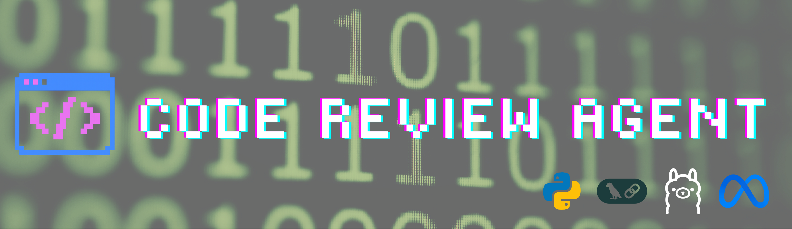

# Code Review Agent

## Overview
Code Review Agent is a full-stack, AI-powered code review system built using LangGraph and an open-source local LLM hosted via Ollama. It performs automated code analysis, issue detection, and structured report generation through a multi-stage LLM workflow exposed via an HTTP API.

A key design goal of this project is local-first AI inference. By using Ollama to host open-source models locally, the system avoids external API dependencies, reduces operational cost, and ensures greater control over data flow—making it well-suited for developer tooling, educational environments, and privacy-conscious workflows.

The project targets developer-facing use cases where teams want consistent, structured feedback on code snippets without relying on manual review, such as:
- Pre-commit checks
- Coding exercises and training
- Rapid code quality triage during prototyping

## Key Features

### Multi-Stage LLM Workflow (LangGraph)
Code review is decomposed into independent reasoning stages:
- Analysis
- Issue detection
- Report generation

Each stage operates as a separate LangGraph node to reduce prompt coupling and improve interpretability.

### Automated Code Analysis
Generates a concise natural-language explanation of:
- Code intent
- Structural design
- Potential concerns

### Issue Detection
Identifies 3–5 concrete issues per submission.

Issues are normalized into a predictable list format for frontend rendering or downstream use.

### Structured Review Reports
Produces a final report that combines:
- Summary
- Issues
- Recommendations

### Local LLM Inference with Ollama
Uses an open-source LLM running locally (default: `llama2:latest`)
- Eliminates per-request API cost
- Avoids data egress
- Provides full control over model selection and configuration

## System Architecture (High Level)

1. **Client Input**  
   User submits source code via `POST /review`.

2. **API Ingestion**  
   FastAPI receives the request and validates the payload schema.

3. **LLM Workflow Execution (LangGraph)**  
   The request flows through a three-node graph:
   - **Analyzer**: High-level understanding of the code
   - **Issue Finder**: Extracts concrete issues and normalizes output
   - **Report Generator**: Produces the final review report

4. **Post-Processing**  
   Output is normalized to ensure deterministic JSON formatting.

5. **Response Delivery**  
   Structured JSON response is returned to the frontend.

### External Dependency
**Ollama (local model server)**  
Configured via environment variables and responsible for LLM inference.

## Why Ollama (Open-Source LLM Hosting)
Using Ollama as the inference layer provides several practical advantages:
- **Cost control**: No per-request inference fees
- **Privacy**: Code never leaves the local environment
- **Flexibility**: Models can be swapped without changing application logic
- **Stability**: No reliance on third-party API availability

### Trade-offs
- Model quality depends on selected open-source model
- Context length and throughput depend on local hardware

The architecture allows hosted LLMs to be introduced later if needed, without redesigning the workflow.

## Design Trade-offs & Lessons Learned
- **Embeddings and chunking issues (earlier iterations)**: Retrieval sometimes returned irrelevant passages and the context window blew up with oversized chunks. This reduced answer quality and made output inconsistent.
- **Why local Ollama instead of OpenAI/Gemini**: Avoiding API keys and external dependencies keeps costs and data exposure low while enabling offline development. It also makes the system easier to run in constrained or private environments.
- **Hallucinated tool calls and wrong outputs**: The agent can still hallucinate tool usage or produce incorrect results, especially when prompts are overly strict or too complex. Stricter rules do not always reduce hallucinations; sometimes simpler, less hard‑coded prompts improve understanding and reduce errors.
- **Current approach**: A simpler, local-first pipeline with tighter post-processing and smaller, well-formed inputs yields more stable results than heavy retrieval or rigid prompt constraints.

## API Reference

### POST `/review`
Submits code for automated review.

**Request Body**
```json
{
  "code": "string"
}
```

**Response Body**
```json
{
  "analysis": "High-level explanation of what the code does and how it is structured",
  "issues": [
    "Issue 1: Description of the first detected problem",
    "Issue 2: Description of the second detected problem",
    "Issue 3: Description of the third detected problem"
  ],
  "report": "A structured review combining summary, issues, and recommendations"
}
```

### Response Semantics
- **analysis**  
  Natural-language overview of code purpose and design.
- **issues**  
  Normalized list of concrete, actionable issues.
- **report**  
  Final synthesized review intended for human consumption.

## Technology Stack

### Backend
- FastAPI – HTTP API layer
- LangGraph – Multi-stage LLM workflow orchestration
- Python 3.9+

### LLM & Inference
- Ollama – Local LLM hosting
- Open-source LLM (`llama2:latest` by default)

### Frontend
- Next.js (App Router)
- React
- TypeScript

### Tooling
- Uvicorn – ASGI server
- npm – Frontend dependency management

## Project Structure
```
CodeReviewAgent/
├── backend/
│   ├── app.py                 # FastAPI app and LangGraph workflow
│   ├── requirements.txt       # Python dependencies
│   ├── .env                   # Local environment variables
│   └── .env.example           # Environment template
├── frontend/
│   ├── src/
│   │   └── app/               # Next.js app router components
│   ├── public/                # Static assets
│   ├── package.json           # Frontend dependencies
│   └── next.config.ts         # Next.js configuration
└── README.md                  # Project documentation
```

## Environment Variables
Backend configuration is handled via a `.env` file.

```
OLLAMA_HOST=http://localhost:11434
OLLAMA_MODEL=llama2:latest
OLLAMA_TEMPERATURE=0.3
```

No secrets are required unless switching to a hosted LLM provider.

## Running Locally

### Prerequisites
- Python 3.9+
- Node.js 18+
- Ollama running locally

### Backend
```
python -m venv codereview
source codereview/bin/activate  # Windows: codereview\Scripts\activate
pip install -r backend/requirements.txt
uvicorn backend.app:app --reload --port 8000
```

### Frontend
```
cd frontend
npm install
npm run dev
```

### Local URLs
- Backend API: http://localhost:8000
- Frontend UI: http://localhost:3000

## How It Works (End-to-End)
1. User submits code via the frontend.  
2. FastAPI receives the request at `/review`.  
3. LangGraph executes the workflow:
   - Analyzer interprets the code
   - Issue Finder extracts problems
   - Report Generator synthesizes results  
4. Ollama handles all LLM inference locally.  
5. Structured JSON output is returned and rendered in the UI.

## Design Principles
- Local-first AI inference
- Separation of concerns across LLM stages
- Deterministic output formatting
- Stateless API design
- Minimal infrastructure assumptions

## Limitations & Future Improvements

### Current Limitations
- No static analysis or AST parsing
- Single model inference path
- No benchmarking or evaluation metrics


## Docker and CI(Additional Details)

### Why Docker
Docker provides a repeatable environment for both the backend and frontend, so dependencies and runtime behavior match across machines and CI. It also makes setup faster for new contributors and simplifies deployment by packaging the services with consistent versions.

### Docker Setup (Cross-Platform)
1. Install Docker Desktop: https://www.docker.com/products/docker-desktop/
2. Ensure Docker is running and the Docker CLI is available.
3. Confirm Compose v2 is installed:
```
docker compose version
```

### Running with Docker Compose
From the repository root:
```
docker compose up --build
```

Services and ports:
- Backend API: http://localhost:8000
- Frontend UI: http://localhost:3000

### Ollama with Docker
Ollama runs outside Docker (on the host) and the backend container connects to it using:
```
OLLAMA_HOST=http://host.docker.internal:11434
```
This is already set in the Compose file for the backend service. Ensure Ollama is running before starting containers.

### Dockerization Notes and Problems Faced
1.Ollama was not reachable from the container at first. The fix was to use `host.docker.internal` so the backend can call the host Ollama server. On Linux, add an extra host mapping in `docker-compose.yml` if needed:
  - `extra_hosts: ["host.docker.internal:host-gateway"]`
2.Frontend Docker build failed due to dependency and build context issues. The working approach is a multi-stage build that runs `npm ci`, then `npm run build`, and copies `.next`, `public`, and `next.config.js` into the runtime image.

### CI Pipeline (GitHub Actions)
The CI pipeline validates the backend, frontend, and Docker build in one job. It runs on every push or pull request to `main` and performs:
1. Checkout repository
2. Set up Python 3.9 and install backend dependencies
3. Validate backend imports with `python -c "import app"`
4. Set up Node 20, install frontend dependencies, and build the frontend
5. Build Docker images using Compose
See [ci.yml](.github/workflows/ci.yml) for the exact steps.